# Complete README.md — Karunesh17

```markdown
<!-- ═══════════════════════════════════════════════════════
     BANNER  (theme-aware — upload dark.svg & light.svg
     to repo root before this renders correctly)
     ═══════════════════════════════════════════════════════ -->
<picture>
  <source media="(prefers-color-scheme: dark)"  srcset="dark.svg"/>
  <source media="(prefers-color-scheme: light)" srcset="light.svg"/>
  
</picture>

<br/>

<!-- ═══════════════════════════════════════════════════════
     SOCIAL BADGES
     ═══════════════════════════════════════════════════════ -->
<p align="center">

  <a href="https://www.linkedin.com/in/karunesh-sharma-22973b272/">
    
  </a>&nbsp;&nbsp;

  <a href="mailto:work.karunesh17@gmail.com">
    
  </a>&nbsp;&nbsp;

  <a href="#">
    
  </a>

</p>

<br/>

<!-- ═══════════════════════════════════════════════════════
     STREAK
     ═══════════════════════════════════════════════════════ -->
<p align="center">
  
</p>

<!-- ═══════════════════════════════════════════════════════
     STATS + TOP LANGS
     ═══════════════════════════════════════════════════════ -->
<p align="center">
  
  
</p>

<br/>

<!-- ═══════════════════════════════════════════════════════
     CONTRIBUTION SNAKE
     Add this block ONLY after the "Generate Contribution Snake"
     Action runs green and the output branch exists.
     ═══════════════════════════════════════════════════════ -->
<picture>
  <source
    media="(prefers-color-scheme: dark)"
    srcset="https://raw.githubusercontent.com/Karunesh17/Karunesh17/output/snake-dark.svg"
  />
  <source
    media="(prefers-color-scheme: light)"
    srcset="https://raw.githubusercontent.com/Karunesh17/Karunesh17/output/snake-light.svg"
  />
  
</picture>
```
